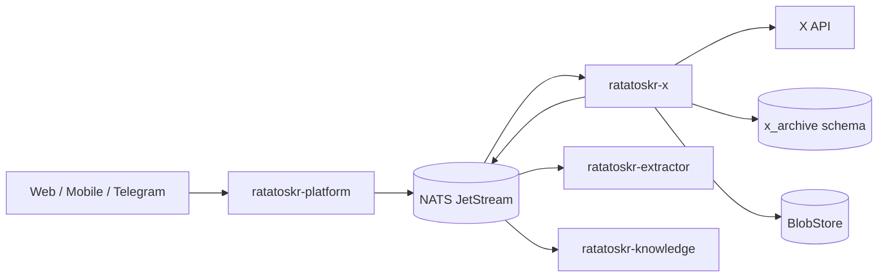
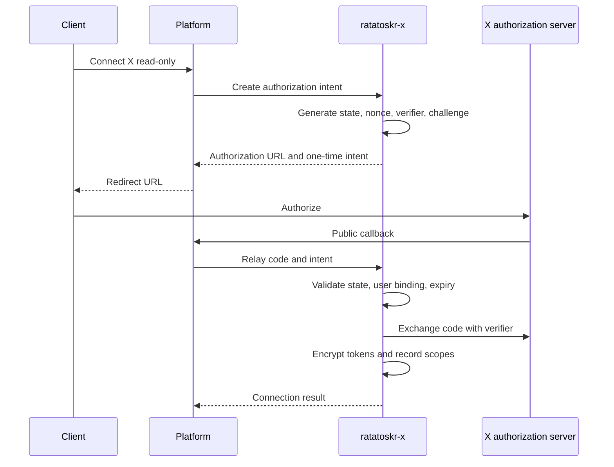
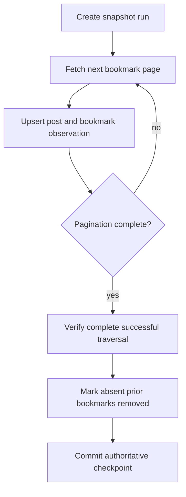

# Ratatoskr X Architecture

> Status: target architecture. The repository is in architecture bootstrap; this document defines the intended X account, bookmark, post, folder, and compliance boundaries.

## 1. Purpose

`ratatoskr-x` is the authoritative X connector for Ratatoskr.

It owns:

- user-authorized X account connections;
- OAuth 2.0 Authorization Code with PKCE;
- encrypted access and refresh tokens;
- bookmarks and bookmark folders;
- post, quote, reply, and repost records;
- long-form text and media metadata when exposed by the API;
- incremental observations and full authoritative snapshots;
- upstream availability/compliance state;
- optional bookmark write-back under separate consent;
- rate-limit and usage budgets;
- migration from the legacy Field Theory import.

It does not scrape the X website, store browser cookies, extract linked articles, or own LLM analysis.

## 2. Architectural position



X remains authoritative for provider account and bookmark state. Ratatoskr-local collections and Knowledge outputs remain separate.

## 3. Repository structure

```text
ratatoskr-x/
├── crates/
│   ├── x-domain/
│   ├── accounts/
│   ├── oauth/
│   ├── bookmarks/
│   ├── folders/
│   ├── posts/
│   ├── media/
│   ├── snapshots/
│   ├── compliance/
│   ├── provider-client/
│   ├── persistence/
│   ├── eventing/
│   ├── telemetry/
│   ├── legacy-import/
│   └── test-support/
├── services/
│   └── x/
├── schema/
├── fixtures/
├── tests/
└── docs/
```

Provider SDK/HTTP details stay behind adapter interfaces. Domain code must not depend on raw provider response shapes.

## 4. Bounded context and data ownership

Recommended schema:

```text
x_archive.accounts
x_archive.credentials
x_archive.posts
x_archive.post_revisions
x_archive.post_relations
x_archive.media
x_archive.bookmarks
x_archive.bookmark_observations
x_archive.bookmark_folders
x_archive.bookmark_folder_items
x_archive.snapshots
x_archive.sync_runs
x_archive.sync_checkpoints
x_archive.rate_limit_state
x_archive.tombstones
x_archive.compliance_checks
x_archive.legacy_imports
x_archive.outbox
x_archive.inbox
```

The service writes only to `x_archive.*`.

It does not own global user identity, local collections, extracted article documents, summaries, or embeddings.

## 5. Account and OAuth architecture

### 5.1. Stable account identity

The provider numeric user ID is stable. Handle/display name are mutable observations.

Account state includes:

```text
connected
refresh_required
reauth_required
revoked
suspended
paused
```

### 5.2. Scope separation

Read-only connection requests the minimum scopes required for bookmark synchronization and background refresh.

Write capability is requested separately and enables bookmark mutations only.

Conceptual separation:

```text
read connection:
  users.read
  tweet.read
  bookmark.read
  offline.access

write extension:
  bookmark.write
```

Exact provider scope names are validated against the current official API during implementation.

### 5.3. PKCE flow



Platform may host the public callback, but X owns OAuth state, exchange, token storage, and scope validation.

### 5.4. Credential storage

- tokens are encrypted with a versioned per-account data key;
- raw tokens never enter events, public APIs, logs, traces, or task fixtures;
- refresh rotation is atomic;
- provider scope changes are recorded;
- revocation and refresh failure are distinguished;
- write consent can be revoked without removing the read connection.

## 6. Post model

A post is distinct from the bookmark relationship.

```text
posts
  external_post_id
  author_external_id
  canonical_url
  text
  long_form_text
  conversation_id
  published_at
  observed_at
  content_hash
  raw_blob_ref
  upstream_status
```

### 6.1. Relations

Relations are explicit edges:

```text
reply_to
quotes
reposts
part_of_thread
```

Missing referenced posts remain unresolved references rather than being silently dropped.

### 6.2. Revisions

If the API exposes changed content or a later observation differs, the service stores a new revision tied to the observation and content hash. Current projection updates without deleting prior evidence.

### 6.3. Media

Media records contain provider metadata and stable blob references only when storage is permitted and configured.

```text
type
dimensions
duration
preview URL observation
provider media ID
alt text
content availability
local blob reference
```

Media download is policy-driven and must not bypass provider authorization or terms.

## 7. Bookmark model

A bookmark is a relationship between an account and a post.

```text
account_id
post_id
first_observed_saved_at
last_observed_saved_at
observed_removed_at
current_state
first_snapshot_id
last_snapshot_id
```

The service does not invent an exact provider `saved_at` or `removed_at` timestamp unless the API supplies it.

### 7.1. Authority

X bookmarks obtained through the official authenticated endpoint use:

```text
saved_authority = AuthoritativePlatformState
acquisition = OfficialApi
```

Legacy imports retain `LegacyObservation` authority until reconciled with a full official snapshot.

## 8. Synchronization architecture

### 8.1. API limitation-aware design

Bookmark listings may provide pagination but not a reliable incremental cursor by bookmark creation/removal time. Therefore the architecture does not assume a true append-only incremental feed.

### 8.2. Frequent head scan

A frequent scan of the first configured pages:

- discovers recent/new bookmarks;
- refreshes post records;
- updates positive observations;
- does not mark unseen bookmarks as removed.

### 8.3. Full authoritative snapshot



If any page is missing or terminally fails, the run is partial and cannot reconcile removals.

### 8.4. Removal invariant

```text
partial scan != proof of removal
```

Only a complete successful account snapshot can set `observed_removed_at` for absent bookmarks.

### 8.5. Checkpoints

Checkpoints store:

- account and snapshot ID;
- pagination state for resumable partial runs when safe;
- start and completion timestamps;
- pages and objects observed;
- API request/cost totals;
- authoritative/partial classification;
- high-level failure reason.

A resumed run cannot mix incompatible provider ordering or schema versions without starting a new snapshot.

## 9. Bookmark folders

Native X folders are provider collections and remain distinct from Ratatoskr-local collections.

The service stores:

- external folder ID;
- name and provider metadata;
- folder observations;
- membership observations;
- folder snapshot runs;
- current membership projection.

Folder listing and membership reconciliation may require separate API calls and rate-limit budgets. A failure in one folder does not invalidate unrelated bookmark post ingestion, but prevents authoritative removal reconciliation for that folder.

## 10. Write-back architecture

Supported write operations may include:

- add bookmark;
- remove bookmark;
- add/remove folder membership when officially supported.

Requirements:

- explicit write consent and scope;
- user confirmation for destructive removal;
- idempotency key;
- per-account serialization where needed;
- current-state check;
- provider response and audit record;
- truthful partial success;
- no automatic mutation based on LLM output or source text.

A failed local indexing step does not roll back a successful provider bookmark mutation.

## 11. Post normalization and linked articles

The X service produces a normalized social source from official provider objects.

It resolves:

- post and author identity;
- text, long-form text, and entities;
- quote/reply/repost relations;
- media metadata;
- expanded external URLs;
- publication and observation timestamps;
- raw provider evidence reference.

For each eligible external URL, the service publishes a separate extraction request. It does not fetch the article itself.

```text
X post -> SocialSource -> Knowledge
expanded URL -> Extractor -> Document -> Knowledge
```

Knowledge can create a composite analysis with separate provenance for the post and linked article.

## 12. Upstream availability and compliance

Provider content state may include:

```text
active
deleted
protected
author_suspended
unavailable
access_lost
unknown
```

The service periodically revalidates records according to provider policy and configured retention.

A compliance/tombstone event updates active projections. Raw locally stored evidence follows the configured legal and provider-policy retention rules; it is not assumed permanently retainable without review.

## 13. Rate-limit and cost architecture

The adapter records:

- endpoint limit, remaining, and reset;
- `Retry-After` and throttling signals;
- request cost/credit usage when available;
- pagination totals;
- user-triggered versus background priority.

Scheduling priorities:

1. explicit user mutation;
2. explicit user refresh;
3. incomplete authoritative snapshot recovery;
4. regular head scan;
5. background compliance refresh.

The service pauses background work before exhausting account/global budgets and applies jittered backoff.

## 14. Commands and events

### 14.1. Commands consumed

```text
x.account.connect_requested.v1
x.account.write_consent_requested.v1
x.bookmarks.scan_requested.v1
x.bookmarks.snapshot_requested.v1
x.bookmark.add_requested.v1
x.bookmark.remove_requested.v1
x.folders.snapshot_requested.v1
x.compliance.revalidate_requested.v1
x.legacy_import_requested.v1
```

### 14.2. Events emitted

```text
x.account.connected.v1
x.account.reauth_required.v1
x.bookmark.observed.v1
x.bookmark.removed.v1
x.folder.observed.v1
x.folder.membership_changed.v1
x.snapshot.completed.v1
x.snapshot.partial.v1
x.post.upserted.v1
x.post.unavailable.v1
social.source.upserted.v1
content.capture.requested.v1
```

Large provider payloads remain in BlobStore; events carry references and hashes.

## 15. Persistence and transactions

Transactions group:

- post/bookmark/folder observation updates;
- snapshot/checkpoint state;
- current projections;
- inbox/outbox records.

Provider API calls occur outside transactions. Snapshot IDs and staged observations prevent interrupted runs from reconciling removals.

At-least-once delivery is handled through command idempotency and event inbox deduplication.

## 16. Failure model

### Transient

- provider timeout or retryable status;
- rate-limit/credit exhaustion;
- token refresh race;
- database, event-bus, or BlobStore outage.

### Action-required

- token revoked;
- missing scopes;
- account suspended or restricted;
- provider product access unavailable;
- write consent absent.

### Partial

- posts ingested but one folder failed;
- bookmark mutation succeeded but Knowledge indexing failed;
- full snapshot became partial after some pages;
- media metadata stored but media download unavailable.

Partial state is explicit and never converted into false removal or false completeness.

## 17. Security boundaries

- Official OAuth/API only for authoritative account synchronization.
- No server-side website login, password storage, cookie storage, hidden API interception, or stealth browser scraping.
- Tokens remain encrypted and service-local.
- OAuth state, nonce, verifier, callback binding, and expiry are validated.
- Write scopes and consent are separate from read access.
- Private/protected content follows account authorization and is not exposed to other users.
- Events and logs exclude tokens, authorization headers, full private posts, and raw provider responses.
- External URLs are routed to Extractor and never treated as trusted commands.
- Source text cannot trigger provider writes.

## 18. Observability

Required telemetry:

```text
x_api_requests_total
x_api_latency_seconds
x_rate_limit_remaining
x_credit_usage
x_sync_duration_seconds
x_snapshot_pages_total
x_snapshot_items_total
x_partial_snapshots_total
x_bookmarks_observed_total
x_bookmarks_removed_total
x_folder_sync_failures_total
x_mutation_results_total
x_reauth_required_total
x_compliance_state_changes_total
queue_lag_seconds
```

Raw post text and user handles are not metric labels. Traces use internal IDs and controlled logging.

## 19. Testing architecture

### Unit

- OAuth intent and scope rules;
- post/relation normalization;
- observation timestamps;
- snapshot reconciliation;
- folder membership semantics;
- rate-limit scheduling;
- mutation idempotency;
- compliance state transitions.

### Integration

- encrypted credential lifecycle;
- SQL schema initialization and transactions;
- fake paginated provider API;
- interrupted/full snapshot behavior;
- outbox/inbox replay;
- BlobStore raw evidence;
- external-link event publication.

### Critical scenarios

- head scan misses an old bookmark and does not remove it;
- failed middle page prevents all removal reconciliation;
- duplicate snapshot command creates one logical run;
- folder failure does not remove memberships;
- write token absent while read sync continues;
- mutation succeeds and downstream indexing fails with partial result;
- protected/deleted post changes availability without leaking content;
- token revocation transitions to reauthorization state.

### Planned workspace end-to-end

- connect account;
- ingest bookmarks and folders;
- normalize post and linked article separately;
- index in Knowledge;
- show operation progress through Platform/Telegram;
- import legacy Field Theory data and reconcile with official snapshot.

## 20. Deployment architecture

The service may expose separate runtime roles from one image:

```text
OAuth/internal API handlers
bookmark snapshot consumers
folder consumers
mutation consumers
compliance consumers
legacy import worker
```

Each role has bounded concurrency and allowlisted NATS subjects.

Dependencies:

- PostgreSQL `x_archive` role;
- NATS JetStream;
- secret encryption backend;
- X API access;
- BlobStore for raw provider evidence/media when enabled.

The service requires no browser, Git CLI, or direct Knowledge database access.

## 21. Legacy Field Theory migration

Migration preserves provenance:

```text
legacy rows
-> acquisition = LegacyImport
-> saved_authority = LegacyObservation
-> original category retained as legacy metadata/local tag candidate
```

Process:

1. Import legacy posts/bookmarks with source database watermark.
2. Preserve original IDs, timestamps, categories, and raw rows.
3. Deduplicate by provider post ID where available.
4. Run official read-only snapshots in shadow mode.
5. Reconcile official bookmarks and folders.
6. Keep Field Theory categories distinct from native X folders.
7. Switch new ingestion to official API.
8. Retain legacy provenance for records not confirmed by API.

## 22. Architectural invariants

1. X official API is authoritative for current bookmark state.
2. Posts and bookmarks are separate entities.
3. Observation timestamps are not presented as provider timestamps.
4. Partial scans never prove removal.
5. Only complete successful snapshots reconcile absence.
6. Native folders and local collections remain distinct.
7. Read and write consent are separate.
8. External writes are idempotent, audited, and never model-triggered.
9. Linked articles are delegated to Extractor.
10. Analysis and embeddings are delegated to Knowledge.
11. Tokens never leave the X service boundary.
12. No website-session automation is used.
13. Provider availability/compliance state is explicit.
14. Delivery is at-least-once and handlers are idempotent.
15. Legacy imports retain non-authoritative provenance until reconciled.

## 23. Evolution

Initial milestones:

1. Account identity, PKCE, encrypted token storage, and read-only connection.
2. Post normalization and frequent bookmark head scan.
3. Complete authoritative snapshot and false-removal tests.
4. Folder listing and membership reconciliation.
5. SocialSource events and linked-article extraction requests.
6. Knowledge and Platform integration.
7. Separate write consent and bookmark mutations.
8. Availability/compliance revalidation.
9. Field Theory import and reconciliation.
10. Production rate-limit/cost budgets and operational runbooks.

Changes to bookmark authority, provider-session policy, or credential ownership require ADRs and coordinated workspace changesets.
